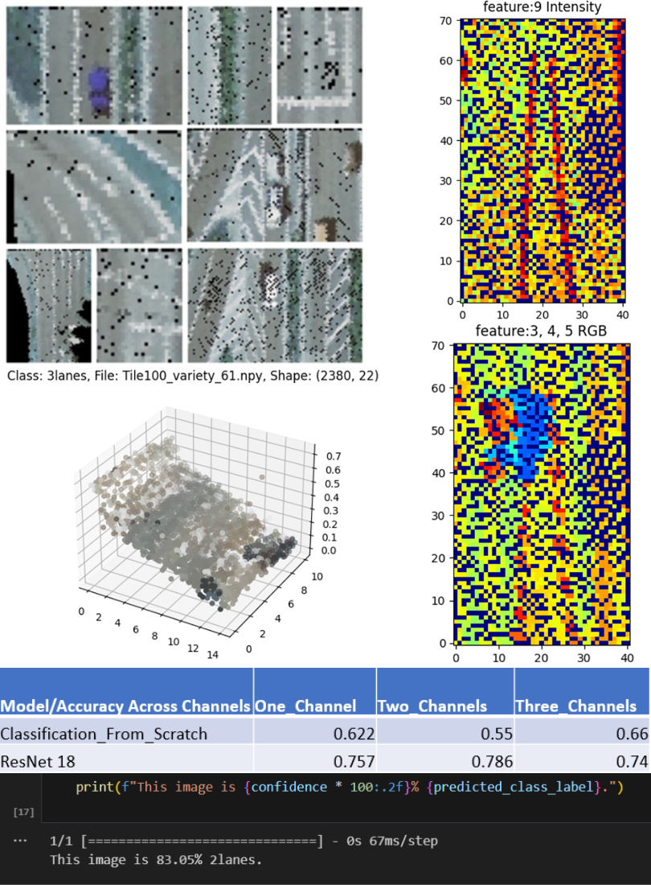

# Road_lanes_classification
Road_lanes_classification_from_pointclouds_using_machine_learning

## Prerequisites
- Python version 3.10
- jupter notebook
note: To ensure seamless integration, please modify the paths as per your specific dataset storage location
### Required libraries
- pip install pandas
- pip install numpy
- pip install python-time
- pip install os-sys
- pip install scikit-learn
- pip install matplotlib
- pip install tensorflow
- pip install torch
- pip install torchvision
- pip install torchstat
- pip install Pillow
- pip install opencv-python
- pip install tqdm
- pip install seaborn
## Approaches used
Approach 1 decision tree
Approach 2 pointcloud2image
Approach 3 point net
Note: Approach 2 was employed due to the nature of the dataset, which consists of road lane segments. The primary focus lies in extracting valuable insights from the surface characteristics.
## Dataset
Road lane segments as .npy

distributed into 6 clasess
1. 2lanes
2. 3lanes
3. crossing
4. split4lanes
5. split6lanes
6. transition

with 22 features
1. 0  local x
2. 1  local y
3. 2  local z
4. 3  red values
5. 4  green values
6. 5  blue values
7. 6  global x
8. 7  global y
9. 8  global z
10. 9  intensity
11. 10 number of lidar returns
12. 11 planarity
13. 12 linearity
14. 13 sphericity
15. 14 verticality
16. 15 mean intensity in 0.3m increments along y 
17. 16 mean intensity in 1.5m increments along y 
18. 17 mean intensity in 0.3m increments along x 
19. 18 mean intensity in 1.5m increments along x 
20. 19 edge area 
21. 20 grid increment index 0.3m resolution
22. 21 intensity principal gradient positions

Note: I provided one example of the dataset 

